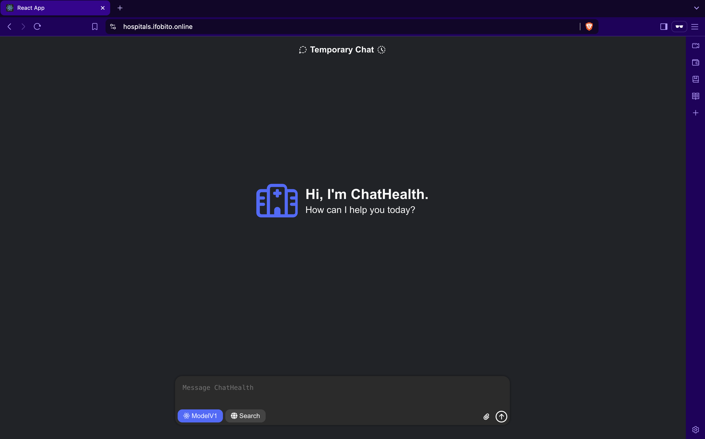
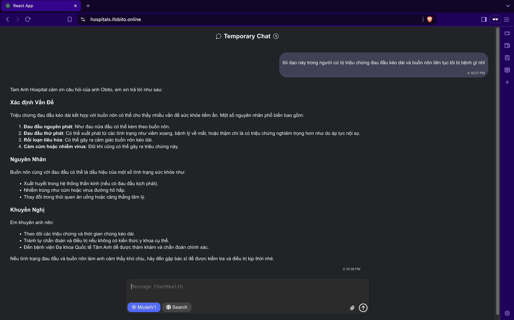
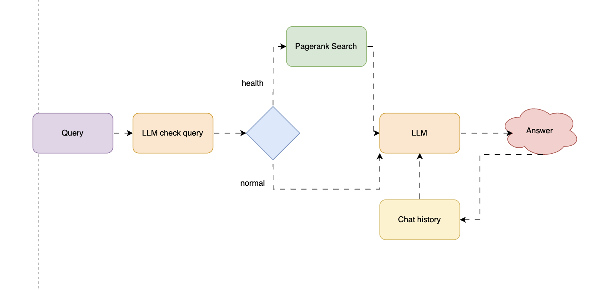

# 🌐 Agent ChatBot For Healthcare

## Mô tả ngắn gọn  
Chatbot y tế sử dụng trí tuệ nhân tạo, tích hợp FastAPI và React, để cung cấp thông tin sức khỏe, tư vấn và hỗ trợ người dùng dựa trên dữ liệu từ website Bệnh viện Đa khoa Quốc tế Tâm Anh.

## Giới thiệu  
Trang web **Agent ChatBot For Healthcare** là một nền tảng trực tuyến ứng dụng công nghệ AI để hỗ trợ người dùng trong việc quản lý sức khỏe. Chatbot này có khả năng:  
- Trả lời câu hỏi về triệu chứng, phương pháp điều trị và hướng dẫn sử dụng thuốc.  
- Nhắc nhở lịch khám bệnh và theo dõi tình trạng sức khỏe.  
- Kết nối người dùng với các bác sĩ qua kênh trực tuyến của Bệnh viện Tâm Anh.  

Với giao diện thân thiện, dễ sử dụng, chatbot mang đến giải pháp tiện lợi, giúp người dân tiếp cận thông tin y tế chính xác mọi lúc, mọi nơi.

## Cấu trúc dự án

```
fuutoru-agent-chatbot-health/
├── README.md                  # Tài liệu hướng dẫn
├── docker-compose.yml         # Cấu hình Docker Compose
├── backend/                   # Backend FastAPI
│   ├── Dockerfile             # Dockerfile cho backend
│   ├── app.py                 # Ứng dụng FastAPI chính
│   └── requirements.txt       # Phụ thuộc Python
└── frontend/                  # Frontend React
    ├── Dockerfile             # Dockerfile cho frontend
    ├── index.html             # Trang HTML chính
    ├── package.json           # Phụ thuộc Node.js
    ├── tsconfig.json          # Cấu hình TypeScript
    ├── vite.config.ts         # Cấu hình Vite
    └── src/                   # Mã nguồn React
        ├── App.tsx            # Thành phần chính của ứng dụng
        ├── components/        # Các thành phần giao diện
        └── styles.css         # CSS toàn cục
```

## Tính năng  
- **Tư vấn y tế**: Trả lời câu hỏi liên quan đến sức khỏe dựa trên dữ liệu từ `tamanhhospital.vn`.  
- **Lịch sử trò chuyện**: Lưu trữ lịch sử chat bằng Redis để duy trì ngữ cảnh.  
- **Giao diện trực quan**: Frontend React với thiết kế tối giản, hỗ trợ Markdown.  
- **Stream phản hồi**: Trả lời theo thời gian thực từ mô hình AI.  

## Yêu cầu cài đặt  
- [Docker](https://docs.docker.com/get opt-docker/)  
- [Docker Compose](https://docs.docker.com/compose/install/)  
- API key từ Google Generative AI và Grok (cấu hình trong tệp `.env`).  

## Hướng dẫn cài đặt  

1. **Sao chép kho lưu trữ**:  
   ```bash
   git clone https://github.com/fuutoru/agent-chatbot-health.git
   cd agent-chatbot-health
   ```

2. **Tạo tệp `.env` trong thư mục gốc**:  
   ```plaintext
   REDIS_URL=redis://redis:6379/0
   GENAI_API_KEY=<your-google-genai-api-key>
   GROQ_API_KEY=<your-grok-api-key>
   ```

3. **Xây dựng và chạy dịch vụ**:  
   ```bash
   docker-compose up --build
   ```
   - Backend FastAPI sẽ chạy tại `http://localhost:8001`.  
   - Frontend React sẽ chạy tại `http://localhost:3001`.  
   - Redis chạy tại `http://localhost:6371`.  

## Cách sử dụng  

### Truy cập giao diện  
- Mở trình duyệt tại `http://localhost:3001` để sử dụng chatbot.  

### Ví dụ trò chuyện  
- **Đầu vào**: "Tôi bị đau đầu, phải làm sao?"  
  - **Đầu ra**:  
    ```
    Tam Anh Hospital cảm ơn câu hỏi của anh Obito, em xin trả lời như sau:  
    Đau đầu có thể do nhiều nguyên nhân như căng thẳng, thiếu ngủ hoặc các vấn đề sức khỏe khác. Anh có thể thử nghỉ ngơi, uống đủ nước và tránh ánh sáng mạnh. Nếu tình trạng kéo dài, anh nên đến Bệnh viện Tâm Anh gần nhất để được kiểm tra nhé!  
    ```

### API Backend  
- **Điểm cuối**: `POST /ask`  
- **Body**:  
  ```json
  {
    "question": "Triệu chứng sốt là gì?"
  }
  ```  
- **Phản hồi**: Stream văn bản Markdown từ chatbot.  

## Giao diện Website  
  
  

## Pipeline hệ thống  
  

## Cấu hình  
- **Cổng**:  
  - Backend: `8001`  
  - Frontend: `3001`  
  - Redis: `6371`  
- **Mô hình AI**:  
  - Google Gemini (`gemini-2.0-flash-lite-preview-02-05`) cho trả lời.  
  - Grok (`llama-3.3-70b-versatile`) cho xác thực câu hỏi.  

## Phát triển  

- **Backend**: Chỉnh sửa `backend/app.py` và khởi động lại container.  
- **Frontend**: Chỉnh sửa các file trong `frontend/src/`, build lại bằng `npm run build`.  

## Khắc phục sự cố  
- **Backend không phản hồi**: Kiểm tra API key trong `.env` và nhật ký bằng `docker-compose logs backend`.  
- **Frontend không tải**: Xác minh kết nối proxy tới backend trong `vite.config.ts`.  
- **Redis lỗi**: Đảm bảo container Redis đang chạy (`docker ps`).  

## Đóng góp  
Hãy gửi issue hoặc pull request để cải thiện dự án. Tuân thủ quy trình đóng góp tiêu chuẩn của GitHub.  

## Giấy phép  
Dự án được cấp phép theo [MIT License](LICENSE). Xem tệp LICENSE để biết thêm chi tiết.  

## Lời cảm ơn  
- [FastAPI](https://fastapi.tiangolo.com/) và [React](https://reactjs.org/) cho nền tảng phát triển.  
- [Tam Anh Hospital](https://tamanhhospital.vn/) cho nguồn dữ liệu y khoa.  
- [Google Generative AI](https://cloud.google.com/ai) và [Grok](https://xai.com) cho mô hình AI.  
